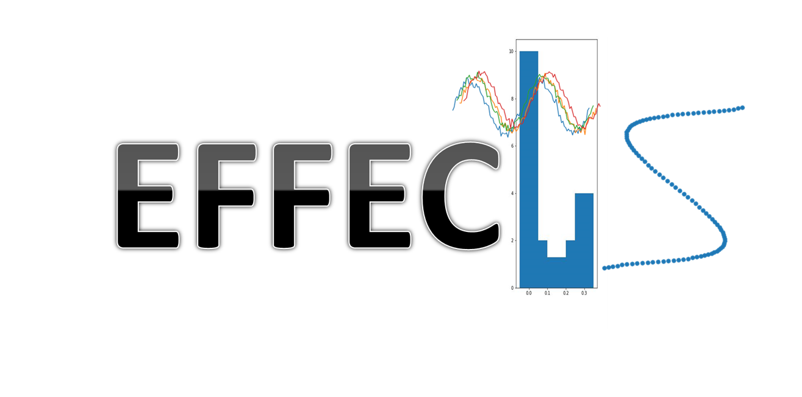

# EFFECTS




EFFECTS is a Python library for explaianle feature extraction for time series data. EFFECTS provide both feature extractor and feature explorer to maximize the performance and the explainability of the model.


## Usage

```python
import effects

# read data
X_train, X_test, y_train, y_test = effects.ts_format_data_loader('datasets/BasicMotions/')

# crate feature extractor
extractor = effects.Extractor()

# extract features
train_features = extractor.fit_transform(X_train, y_train)
test_features = extractor.transform(X_test, y_test)
```

## Performance
| Dataset            | 1nn-dtw | dCAM     | XEM  | WEASEL+MUSE | EFFECTS  |
| ------------------ | ------- | -------- | ---- | ----------- | -------- |
| AtrialFibrillation | 0.27    | 0.45     | 0.47 | 0.27        | **0.66** |
| Eth.Concentration  | 0.30    | 0.39     | 0.37 | 0.32        | **0.67** |
| HandMov.Dir.       | 0.31    | 0.33     | 0.65 | 0.38        | **0.66** |
| Libras             | 0.8     | **0.93** | 0.92 | 0.85        | 0.91     |
| LSST               | 0.58    | 0.66     | 0.65 | 0.63        | **0.71** |
| SelfReg.SCP1       | 0.77    | 0.86     | 0.84 | 0.74        | **0.90** |
| SelfReg.SCP2       | 0.53    | 0.60     | 0.55 | 0.52        | **0.66** |
| StandWalkJump      | 0.33    | **1**    | 0.40 | 0.47        | 0.54     |

## Contributing

Pull requests are welcome. For major changes, please open an issue first
to discuss what you would like to change.

Please make sure to update tests as appropriate.

## License

